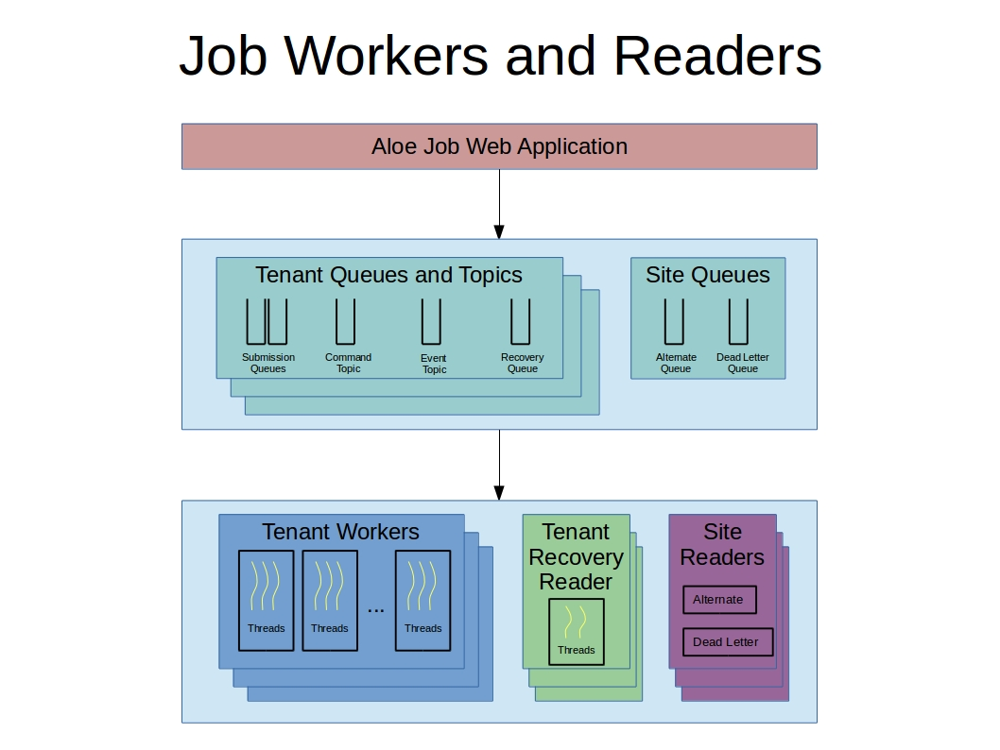

Jobs Service Architecture
=========================

.. contents:: Table of Contents

Design Guidelines
-----------------

The focus of the Jobs service redesign effort is to improve reliability, scalability, performance and serviceability.  To achieve these goals, the following design guidelines were put in place:

- Efficient database usage
    - Database polling is prohibited
    - Database transactions boundaries are clearly defined
    - Database reads and writes are optimized for each application task
    - Log and monitor database calls
- Queue management system
    - Asynchronous tasks managed by a broker
    - Quality of service guarantees including durability, redelivery on client failure, etc.
- Explicit Job state machine
    - Only valid state transitions allowed
- Separation of front and back ends
    - HTTP data types and processing limited to front end web application
    - Backend job processing performed by Java workers running in their own JVMs
    - Horzontal scaling achieved by adding more workers
- Recovery subsystem 
    - Manage transient errors
    - Aggregate and manage all jobs blocked on same error condition
    - Allow customizable recovery policies 
- Efficient thread management
    - Asynchronous message sending to jobs and workers 
    - Thottled thread restarting during recovery
- Actionable error messages and log records
    - Capture enough data for root cause analysis
- Crytographic validation of requests
    - JWT signatures checked
- Software engineering best practices 
    - Technology choices that simplify design, code, operations and deployment
    - Example: removal of Hibernate
    - Example: use of JAXRS reference implementation
    - Example: standardized treatment of configuration files, environment variables and command line parameters
    
3 Tier Architecture
-------------------

.. image:: Aloe3TierArchitecture.jpg

The Jobs service implements a 3-tiered application with the user interface layer defined by a REST API, the application layer comprised of Java web applications and daemons, and the persistence layer comprised of a MySQL database, a RabbitMQ queue management system and the existing Agave Notifications service.

REST API Layer
^^^^^^^^^^^^^^

The *Jobs REST Interface* provides the interface through which web portals and other applications can communicate with the Jobs service.  As much as possible, the API maintains the legacy Agave syntax and semantics, see `Job Service Changes <aloe-job-changes.html>`_ for details. 

Application Layer
^^^^^^^^^^^^^^^^^

The application layer implements job REST endpoints using two web applications.  The *Legacy Job Web Application* supports all HTTP GET requests and all requests concerned with permissions.  Since the new Jobs service focuses on improving job execution (see `Design Guidelines`_), we realized that REST APIs that do not directly interact with executing jobs did not have to be rewritten.  Development costs were significantly reduced by reusing existing code for read-only and permission related requests.   The Legacy web application is a stripped down version of the Agave Jobs front end ported to work with an updated MySQL schema; it does not interact with the queue management system.

The *Aloe Job Web Application* handles all POST, PUT and DELETE requests except those concerned with permissions.  The main function of this new web application is to accept requests for job execution and cancelation.  In addition, requests to resubmit jobs and to change the visibility of jobs are also supported.  This web application interacts with both the MySQL database and the RabbitMQ system.

Each tenant is configured with at least one *Job Worker* application, which is a standalone Java daemon running in its own JVM.  Each job worker reads job submission requests from a single queue and executes those requests.  Workers can process multiple job requests at a time.  For scalability, multiple workers can service the same queue and tenants can define multiple submission queues for even greater flexibility.

*Job Readers* are standalone Java daemons that run in their own JVM and perform specialized tasks related to job execution.  These programs are called readers because they receive their input by reading a specific queue or topic.  The three readers currently implemented are the recovery reader, alternate reader and dead letter reader.  See `Workers and Readers`_ below for details.

Persistence Layer
^^^^^^^^^^^^^^^^^

The web applications, workers, most of the readers and numerous administrative utility programs access the *MySQL* database.  For performance, reliability and  design simplicity, all database access from the Jobs service is via direct JDBC driver calls.  The database schema contains six new tables, modifications to several existing tables and the removal of the Agave *jobs* table.  The contents of the Agave *jobs* table are migrated to the new *aloe_jobs* table to maintain historical continuity.  A single database instance continues to support all tenants defined in the system.

The *RabbitMQ* queue management system was introduced in Aloe to provide reliable, non-polling communication between application layer components.  Most exchanges, queues, topics and messages are specified as durable so that they can be recovered in the event of application or RabbitMQ broker failures.  Unroutable messages are captured and logged.  Expired messages and messages rejected due to capacity constraints are also logged.
 
The *Legacy Notifications* service continues to support persistent, application-level event notifications.  The new Jobs service integrates calls to the Agave Notification service as it executes jobs, by and large preserving existing Agave behavior from the client's point of view (see `Job Service Changes <aloe-job-changes.html>`_ for details).

Workers and Readers
-------------------

The application-level worker and reader programs are queue driven Java programs running in individual JVMs.  Some of these programs service a single tenant while others service all tenants.  The following sections describe each of these programs, the queues or topics they service and the messages they process.

Tenant Workers
^^^^^^^^^^^^^^

Tenant Recovery Readers
^^^^^^^^^^^^^^^^^^^^^^^

Site Alternate Readers
^^^^^^^^^^^^^^^^^^^^^^

Site Dead Letter Readers
^^^^^^^^^^^^^^^^^^^^^^^^

Runtime Architecture
--------------------

